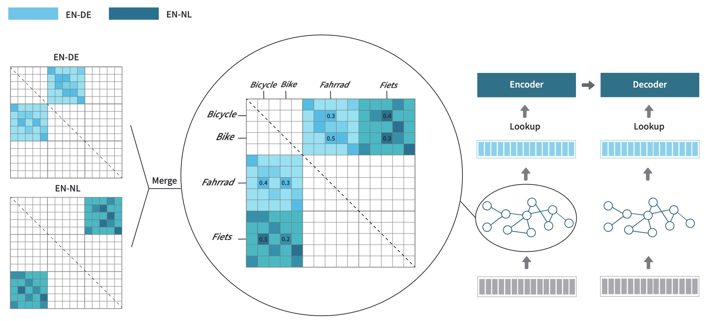

# Beyond Shared Vocabulary
Here is the repo for our EMNLP23 paper "Beyond Shared Vocabulary: Increasing Representational Word Similarities across Languages for Multilingual Machine Translation".

See [preprint](https://arxiv.org/pdf/2305.14189.pdf)

See [Poster](materials/EMNLP23%20-%20Poster.pdf)

The full code and data are releasing.

## Introduction


Using a shared vocabulary is common practice in Multilingual Systems, like Multilingual Translation, mBERT, or nowadays LLM. In addition to its simple design, shared tokens play an important role in positive knowledge transfer, assuming that shared tokens refer to similar meanings across languages. However, when word overlap is small, especially due to different writing systems, transfer is inhibited.

In this paper, we encourage word-level knowledge transfer via graph networks, which bridge the knowledge sharing among words that have similar meanings but write in different ways (no matter whether they use the same or different writing systems). Broadly speaking, we mine priors of word equivalences and inject them into the embedding table, resulting in better knowledge transfer among multilingual translation systems. Our experiments demonstrate multiple advantages of our approach: 
1) Better multilinguality: Embeddings of words with similar meanings are better aligned across languages.
2) Better MMT performance: up to an average of 2.3 BLEU gain is achieved for high- and low-resource MMT.
3) Efficiency: Less than 1.0% additional trainable parameters are required with a limited increase in computational costs, while inference time remains identical to the baseline.

[//]: # (## Requirements)

[//]: # (​```)

[//]: # (git clone git@github.com:research-anonymous/beyond_shared_vocabulary.git)

[//]: # (​```)

[//]: # ()
[//]: # (​```)

[//]: # (cd beyond_shared_vocabulary/fairseq)

[//]: # (​```)

[//]: # ()
[//]: # (​```)

[//]: # (pip install --editable ./)

[//]: # (​```)

[//]: # ()
[//]: # ()
[//]: # (## Experiments)

[//]: # (1&#41; For the experiments on the IWSLT-14 dataset: We provide the script in [iwslt14-30k-graphmerge-hop1.sh]&#40;https://github.com/research-anonymous/beyond_shared_vocabulary/blob/main/iwslt14-30k-graphmerge-hop1.sh&#41;.)

[//]: # (2&#41; For the experiments on the WMT30 dataset: We provide the script in [EC30_128K_graphmerge.sh]&#40;https://github.com/research-anonymous/beyond_shared_vocabulary/blob/main/EC30_128K_graphmerge.sh&#41;. Due to the big scale, we will put the original data and the corresponding data_bin in another place and it will be released soon.)

[//]: # (3&#41; We will also provide the graph-building script to the community for better practice. Now, we provide the pre-built graph in [data_bin]&#40;https://github.com/research-anonymous/beyond_shared_vocabulary/tree/main/iwslt14-30k/alignment_matrix.npz&#41;)

[//]: # ()
[//]: # (## Others)

[//]: # (The current codebase is fine to show the main experiments. A more complete README.md file is on editing. )
